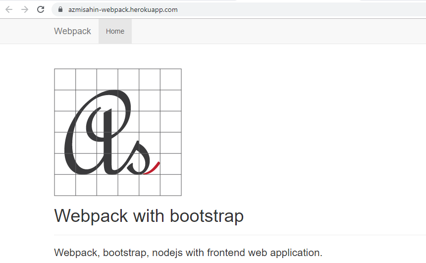

# Webpack Web Application

Webpack, nodejs, express, bootstrapt

# Continuous Deployment

https://azmisahin-webpack.herokuapp.com/

# Status

# Installation
$ npm install

# Build
$ npm run build

# User
$ watch
$ webpack
$ npm run server

# Developer Dependencies
- clean-webpack-plugin
- css-loader
- csv-loader
- file-loader
- html-webpack-plugin
- lodash
- style-loader
- webpack
- webpack-dev-server
- xml-loader
- express
- webpack-dev-middleware
- uglifyjs-webpack-plugin
- webpack-merge

